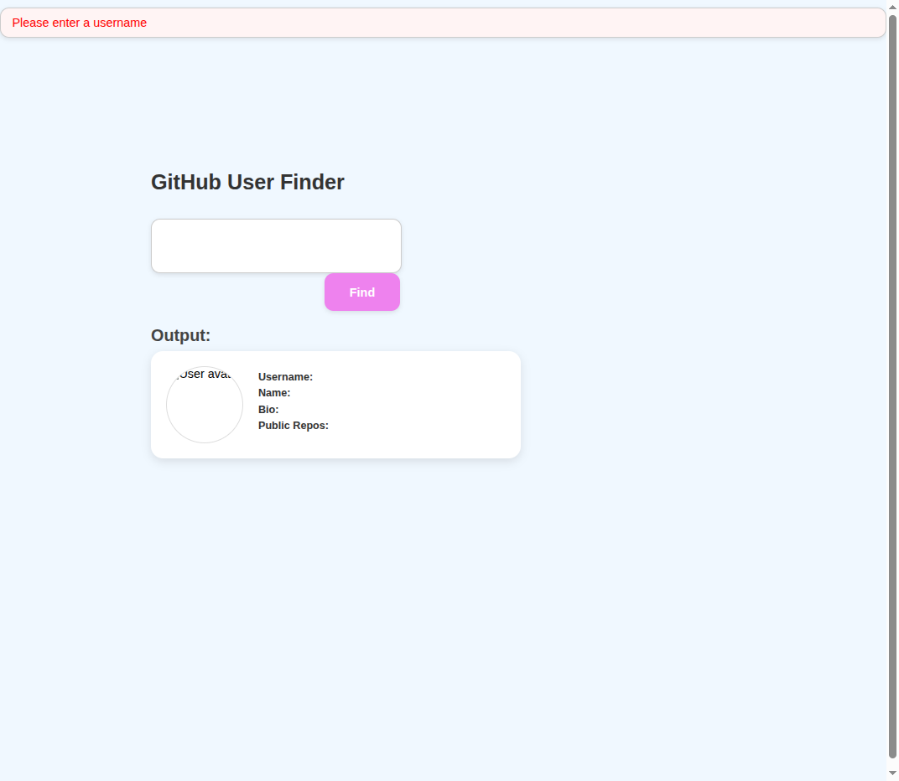

# 🔍 GitHub User Finder

A simple web app that allows users to search for GitHub profiles by username and view basic profile details.

## ✨ Features

- Input a GitHub username and fetch the user's public profile data using GitHub API.
- Displays:
  - Avatar
  - Username
  - Name
  - Bio
  - Public repository count
  - Profile link
- Handles loading state and errors (e.g., user not found or empty input).
- Accessible and responsive design structure.

## 🛠️ Built With

- HTML
- CSS
- JavaScript (Vanilla)
- GitHub REST API

 ## 📸 Preview

